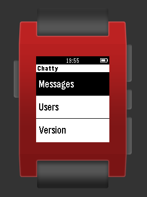
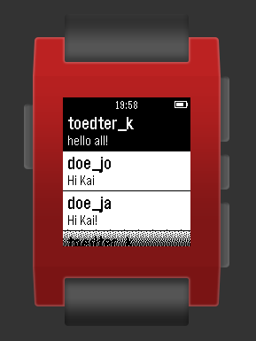
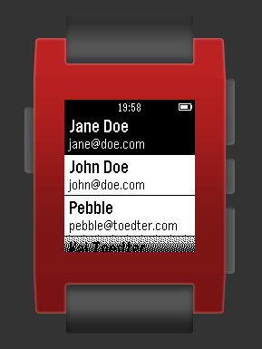
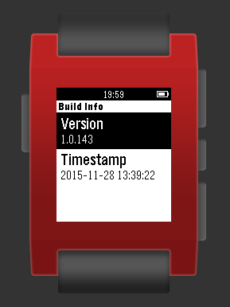

= pebble-chatty

Pebble Chatty is a small client for link:https://github.com/toedter/chatty[Chatty], running on a Pebble smartwatch.
It gets JSON data from the RESTful hypermedia services of https://chatty42.herokuapp.com/api and displays them on the Pebble.

[[screenshots]]
== Screeshots

[[license]]
== License

MIT, see http://toedter.mit-license.org

